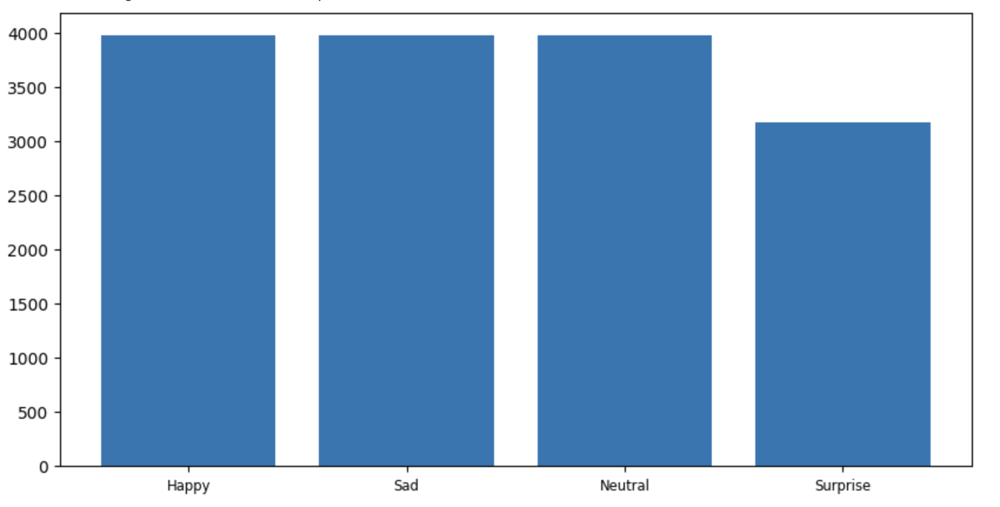
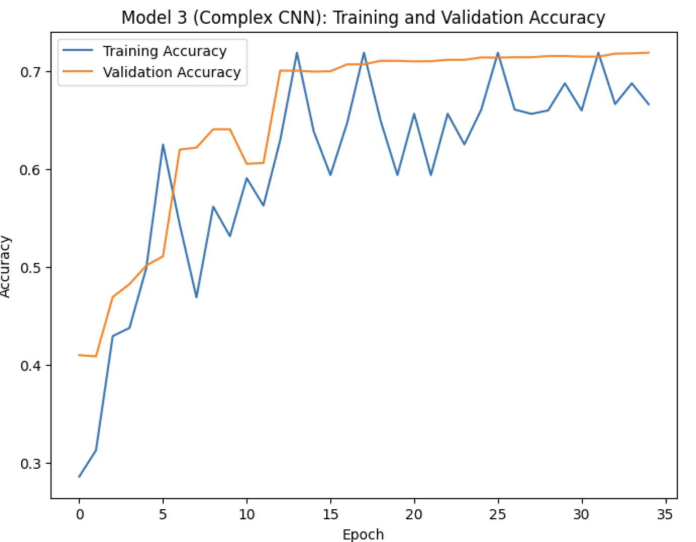
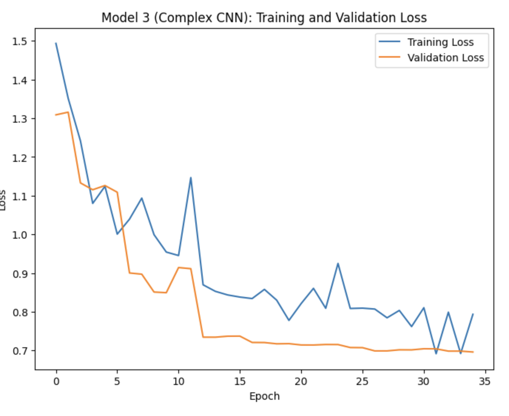
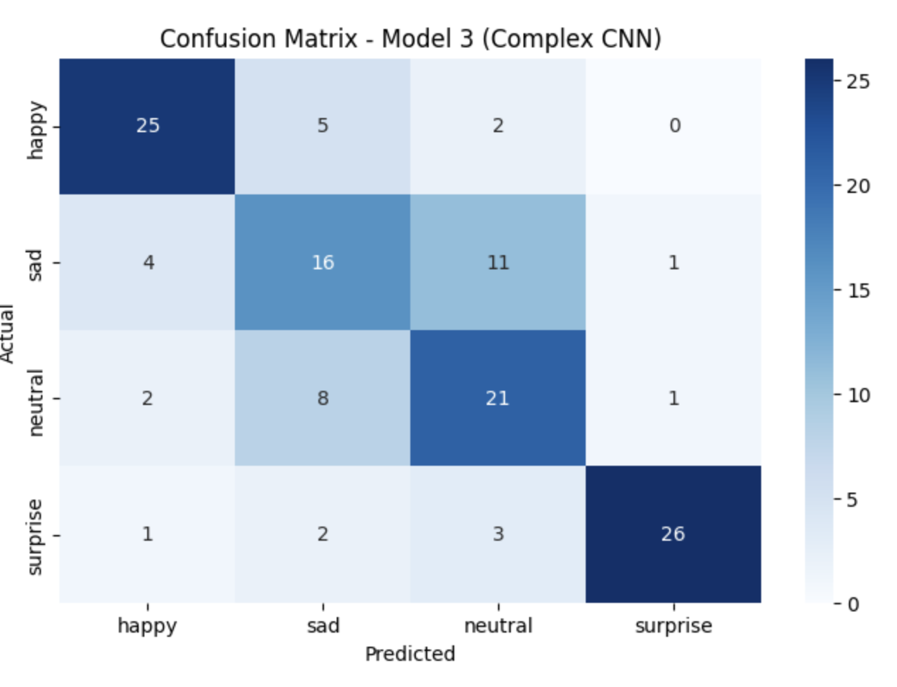

# Facial Emotion Recognition for Mental Health Awareness in Education

## Background and Overview

As part of my graduate studies and growing interest in education technology and student well-being, I developed this facial emotion recognition model to explore how data and deep learning can help educators better understand students' emotional states. In increasingly digital classrooms, teachers lose access to vital non-verbal cues that signal how students are feeling, whether they are engaged, confused, or struggling. I wanted to create a tool that could help bring those cues back into the picture.

This project uses deep learning and computer vision to classify four basic emotions—happy, sad, neutral, and surprise—from grayscale facial images. My goal was not just technical performance but practical relevance: a lightweight, efficient model that could be realistically deployed in educational tools to support mental health monitoring and adaptive teaching strategies. 

## Data Overview

The dataset contains approximately 15,000 labeled facial images organized into training, validation, and test sets. Each image is a 48x48 grayscale photo categorized into one of four emotion classes. I chose to use grayscale images to reduce complexity and preserve privacy, focusing the model on facial structure rather than color features.

* Input shape: (48, 48, 1)
* Emotion classes: happy, sad, neutral, surprise
* Format: folder structure with labeled subdirectories

This simple structure made preprocessing and training straightforward and allowed me to concentrate on model design and evaluation.

## Entity Relationship Diagram (ERD)

Although this project doesn't rely on a traditional relational database, I created a conceptual ERD to illustrate how this model's structure could integrate into broader educational systems. It includes three core entities:

* Image (Image ID, Pixel Array, Label)
* Emotion (Label, Description)
* ModelResult (Image ID, Predicted Label, Confidence Score)

This abstraction can apply to educational software platforms that track student responses or behavioral trends.

## Methodology and Model Building

In this project, I explored how deep learning can support emotion recognition by building and evaluating multiple neural network models. I began by testing several well-known pre-trained architectures, including VGG16, ResNet101, and EfficientNetB0, applying transfer learning to adapt them to the task of facial emotion classification using grayscale images. To better fit the structure and limitations of the dataset, I then designed a custom convolutional neural network (CNN) from scratch. This model was built to detect four emotion categories—happy, sad, neutral, and surprise—using only structural facial features. By comparing these models, I was able to analyze their performance, identify key limitations, and ultimately recommend a solution that balances accuracy, efficiency, and practical relevance in educational contexts. The table below compares the performance of each model 

### Model Comparison

| Model             | Description                                     | Test Accuracy | Notable Strengths         | Limitations                      |
|------------------|-------------------------------------------------|---------------|----------------------------|----------------------------------|
| VGG16            | A classic pre-trained image model               | ~53%          | Recognizes clear patterns  | Struggled with grayscale input  |
| ResNet101        | Deep network with shortcut connections          | ~25%          | Good on complex datasets   | Overfit, poor emotion accuracy  |
| EfficientNetB0   | Lightweight, balanced deep model                | ~27%          | Compact and scalable       | Did not adapt well to task      |
| Custom CNN (Model 3) | Built from scratch for this project           | **~69%**       | Best accuracy and balance  | Slight confusion on subtle emotions |

The four different models were trained to classify emotions in grayscale facial images. The pre-trained models—VGG16, ResNet101, and EfficientNet—were designed for general object recognition and performed inconsistently in this context. VGG16 achieved moderate accuracy, while ResNet and EfficientNet struggled with the grayscale format and the subtle differences between emotional expressions. In contrast, the custom CNN I developed was specifically designed for this task and dataset. It achieved the highest accuracy at around 69 percent and showed the best overall balance across emotion categories. This suggests that a model built to match the data and problem often performs better than larger, general-purpose architectures.

The final model achieved 68.75% accuracy on unseen test data using grayscale-only inputs. I tested several approaches, including popular pre-trained models like VGG16, ResNet101, and EfficientNet. Surprisingly, the best results came from a custom convolutional neural network (CNN) that I built and trained from scratch. 

Key metrics:

* Test Accuracy: 68.75%
* Happy F1 Score: 0.78
* Surprise F1 Score: 0.87
* Lowest Recall: Sad (0.50)
* Key confusion: Sad vs. Neutral

This model performed best in identifying clear, expressive emotions like surprise and happiness. It showed that a focused, task-specific model could outperform larger, general-purpose architectures when trained appropriately.

## Accuracy and Loss Curves

### Confusion Matrix

## Insights Deep Dive

One major insight I gained is that happy and surprise expressions are much easier for the model to detect. Their distinctive shapes—smiles and widened eyes—make them visually obvious, and the model picked up on that quickly. This means that these emotion predictions are the most reliable when used in a classroom context.

Another key takeaway is that grayscale images were entirely sufficient. Even without color, the model performed well. This has practical implications for privacy, efficiency, and hardware constraints in real-world classroom tools.

I also found that large pre-trained models aren’t always better. The custom model I built was more adaptable to this task and dataset. It outperformed the transfer learning models across the board.

Finally, the confusion between sad and neutral emotions showed me that emotional expression is nuanced. This model provides a strong starting point, but I see the need for richer data inputs—like voice tone or behavioral patterns—to capture the full picture.

## Recommendations

1. I recommend using this custom model in real-time educational tools, especially those aimed at increasing engagement or supporting student mental health.
2. Its output could inform educators when students seem disengaged or emotionally withdrawn, prompting timely interventions.
3. Future versions should incorporate additional emotional categories and more diverse student data.
4. Blending modalities—adding speech or clickstream behavior—could significantly improve emotional understanding.

## Caveats and Assumptions

This model is based on a simplified dataset and focuses on just four emotions. It assumes frontal face images with consistent lighting and expression clarity. In real-life settings, facial expressions vary across cultures, age groups, and environments. Additionally, some emotion categories like sadness and neutrality are hard to differentiate even for humans. The model should be used as a supportive tool, not as a replacement for human judgment. Any high-stakes applications should always include a feedback loop and ethical safeguards.

Another important ethical consideration involves the risk of misinterpretation or overreliance on emotion predictions. Facial expressions do not always reflect how a student is truly feeling, and emotional states can vary significantly across cultural, neurological, or personal contexts. There is a risk that educators or systems might draw conclusions from the model’s output without proper context, potentially reinforcing bias or making inaccurate assumptions about a student’s engagement or well-being. To mitigate this, I believe any implementation should be transparent about its limitations, include opt-in consent from users, and be used only as one component in a broader system that values human oversight and feedback. Emotion recognition, when applied thoughtfully, can support inclusion and responsiveness—but only when paired with ethical design, continuous validation, and respect for student autonomy.

## Tools and Libraries
Python, TensorFlow, Keras, OpenCV, NumPy, Pandas, Scikit-learn, Matplotlib, Seaborn, Jupyter Notebook, Google Colab, Canva

## Skills Demonstrated
Data preprocessing, CNN architecture design, transfer learning, model evaluation, image augmentation, classification metrics, ethical analysis, visual reporting, GitHub portfolio development

